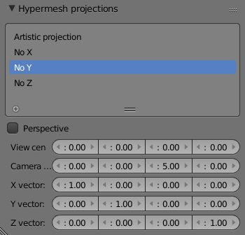
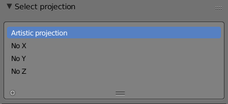
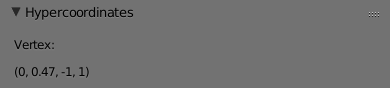

# Hypermesh addon user guide

The Blender hypermesh addon allows the manipulation of meshes in 4-dimensional Euclidean space.
This is achieved by using ordinary Blender tools to manipulate _projections_ of this 4-mesh
to 3-dimensional Euclidean space.

This is the user guide for the addon.
It is intended for anybody who wants to _use_ the hypermesh addon.
If you want to understand (or work on) the code, please read this document and also the
file `internals.md`.

{::options toc_levels="2..6" /}
* this is where the TOC will be
{:toc}

## Installation

There are two ways of installing the addon:

 - The recommended option is to download/clone the repository, and run the script `package.py`.
   This will zip up the contents of the `addon` folder into a file called `hypermesh.zip`
   (and do some useful renaming).
   You can then install the addon using Blender's `File -> User Preferences... -> Install from File...`
   and picking the generated zip-file.

 - Alternatively, you can manually copy the addon into the Blender addons folder.
   To find out where it is located on your system, [consult Blender's documentation](https://www.blender.org/manual/getting_started/installing/configuration/directories.html).
   Most likely, it is `[Blender config directory]/scripts/addons/`.

   Make sure the addon gets its own folder.
   The recommended name for the addon's folder is `hypermesh`,
   so that you get files `[Blender config directory]/scripts/addons/hypermesh/__init__.py`
   and so on.

Don't forget to also _enable_ the addon in the user settings.

To remove the addon, you can use the _Remove_ button in Blender's user preferences,
or just delete the directory that the addon was installed in (typically `[Blender config directory]/scripts/addons/hypermesh/`).

## Math

This section describes the mathematics underlying the addon.
It is recommended that you read this section to understand the exact behavior of the addon.
The mathematical concepts will be illustrated using pictures in one dimension lower
(so the pictures show how the analogous addon would work for manipulating 3-dimensional meshes
using software than handles 2-dimensional meshes).

### Projecting from 4-space to 3-space

The meshes that are handles by the addon are meshes living in 4-dimensional Euclidean space.
These meshes have

 - vertices: each vertex has a position given by 4 floating point numbers
 - edges: an edge connects two vertices
 - faces: a face spans several edges

This is just like an ordinary Blender mesh, except that vertices have 4 coordinates.
The addon does **not** handle hyperfaces, 3-dimensional faces of 4-dimensional meshes.
(Such hyperfaces would overlap after projection to 3-space. There are
currently no plans to ever support hyperfaces.)

A hypermesh is visualized in the 3D view by _projecting_ it to 3-dimensional Euclidean
space (the same way that 3-dimensional objects in the viewport are visualized by projecting
onto a flat monitor for most users — so, really, the 4-meshes are projected to 3-space
and then to 2-space, and that's what you see).

The following picture illustrates such a projection.

The 3-dimensional space is projected to the 2-dimensional space represented by the semi-transparent plane.
At the center of this plane is a black dot known as the _view center_.
The camera position is the other black dot.
The picture shows the projection of the white dot to the plane.

 - If the projection is _perspective_, the projection of the white dot onto the plane is
   the red dot on the yellow line (the line connecting the camera and the point to be projected).
 - If the projection is _not perspective_, the projection of the white dot onto the plane is
   the red dot on the green line (the green line is parallel to the purple one connecting camera and
   view center).

What the addon does is the analogous operation from 4-space to 3-space.
The following parameters describe a projection:

 - `View center`: the origin of the 3-space that we are projecting to
   (the rightmost black dot in the picture)
 - `Camera offset`: the vector from the `viewcenter` to the camera's position
   (purple and pointing to the left in the picture)
 - `X vector`: the vector such that (view center + x vector) is projected to (1,0,0)
   (blue and pointing to the lower right in the picture)
 - `Y vector`: the vector such that (view center + y vector) is projected to (0,1,0)
   (orange and pointing up in the picture)
 - `Z vector`: the vector such that (view center + z vector) is projected to (0,0,1)
   (missing from the picture because there's a dimension missing)
 - `Perspective`: whether to project using perspective or not

In the picture above, the white point gets mapped to about (0.4, -0.2) in the perspective case,
and to about (0.8, -0.3) in the non-perspective case.

### Updating hyperposition after mesh edit

When the hyperposition of a vertex is changed, it is re-projected and the 3D view shows
the updated projection.
This is straightforward.
However, when the _projection_ of the vertex is manipulated, updating its hyperposition
is ambiguous: there are infinitely many points in 4-space that project to the given point.
To resolve this ambiguity, the addon does the following: _when a vertex is moved in 3-space,
the underlying point in 4-space moves **parallel** to the projection 3-space_.

## Using the addon

### Creating a hypermesh

By default, the addon does not affect any of Blender's mesh operations.
Only the meshes that are explicitly marked as _hypermeshes_ will be treated by the addon.

There are two ways of creating a hypermesh:

 - To turn an existing mesh into a hypermesh, select it and call the `Make hyper` operator
   (`<spacebar> -> Make hyper` in the 3D view).
 - You can also insert a hypermesh using the `Insert hypercube` operator
   (`<spacebar> -> Insert hypercube` in the 3D view).

### UI panels

Now that you have created a hypermesh, new panels appear in the UI:

 - In the Scene context of the Properties window, a panel called _Hypermesh projections_
   lists the projections from 4-space to 3-space that are available in the scene.

   Four useful projections are added by default. These are called _No W_, _No X_, _No Y_ and _No Z_.
   The projection _No W_ just projects the point (w,x,y,z) to (x,y,z), effectively allowing you
   to directly edit 3 of the 4 coordinates of each vertex. The other default projections
   are analogous.

   Projections can be edited in this panel. For the meaning of the different options, refer
   to the math of the projections earlier in this document.

   You can rename a projection by double-clicking on its name. It is currently impossible
   to add or remove projections (so you'll always have 4 in the scene).

 - In the properties panel in the 3D View, another panel called _Select projection_
   allows you to select which projection to use for the selected object.
   When you pick a different projection, the 3-dimensional mesh changes shape (but the underlying
   4-dimensional mesh stays the same).

 - In the 3D View when editing a hypermesh (`<tab>` for edit mode), a panel called
   _Hypercoordinates_ shows the average of the positions of all selected vertices
   in 4-space.
   Please read the subsection _Updating the hypercoordinates_ before using this panel.

    

    

    

### Updating the hypercoordinates

When the 3-dimensional projection of a hypermesh is manipulated,
the hypercoordinates of the vertices are not automatically updated (for performance reasons).
If you want to force an update of the hypercoordinates, use the `Update hypercoordinates` operator
(`<spacebar> -> Update hypercoordinates`).
Note that this is necessary in order for the panel _Hypercoordinates_ to show the correct coordinates (!).

If you are not interested in precise hypercoordinates, it is not necessary to call the
`Update hypercoordinates` operator. For example, when you change a hypermesh's projection,
the hypercoordinates are recalculated automatically before the hypermesh is projected using
the new projection.

